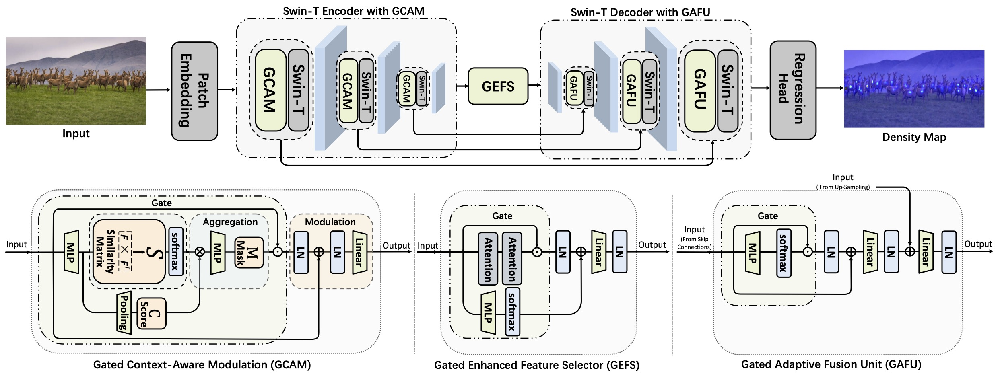
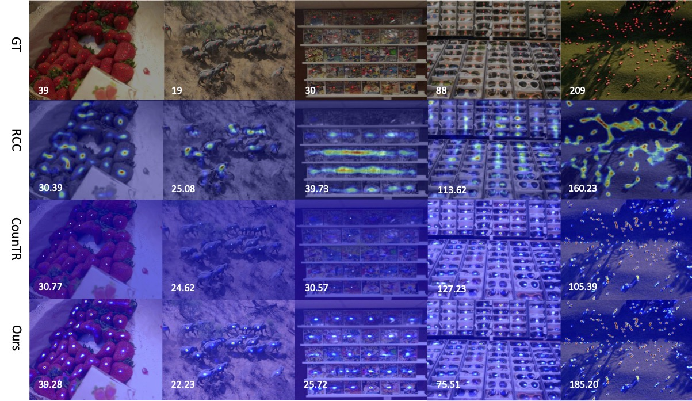

# GCA-SUNet


Official PyTorch implementation of the ICME 2025 paper: **GCA-SUNet: A Gated Context-Aware Swin-UNet for Exemplar-Free Counting**
<p align="center">
  <a href="https://arxiv.org/abs/2409.12249">
    
  </a>
</p>


## Abstract
Exemplar-Free Counting aims to count objects of interest without intensive annotations of objects or exemplars. To achieve this, we propose a Gated Context-Aware Swin-UNet (GCA-SUNet) to directly map an input image to the density map of countable objects. Specifically, a set of Swin transformers form an encoder to derive a robust feature representation, and a Gated Context-Aware Modulation block is designed to suppress irrelevant objects or background through a gate mechanism and exploit the attentive support of objects of interest through a self-similarity matrix. The gate strategy is also incorporated into the bottleneck network and the decoder of the Swin-UNet to highlight the features most relevant to objects of interest. By explicitly exploiting the attentive support among countable objects and eliminating irrelevant features through the gate mechanisms, the proposed GCA-SUNet focuses on and counts objects of interest without relying on predefined categories or exemplars. Experimental results on the real-world datasets such as FSC-147 and CARPK demonstrate that GCA-SUNet significantly and consistently outperforms state-of-the-art methods.




## Getting Started

### Installation
```bash
pip install -r requirements.txt
````

### Data Preparation (FSC-147)

Download the following and place them as indicated:

1. **Original FSC-147 dataset** from *[Learning to Count Everything](https://drive.google.com/file/d/1ymDYrGs9DSRicfZbSCDiOu0ikGDh5k6S/view?usp=sharing)* → put under `DATA_folder`

2. **Additional FSC-147 data & split** [FSC147\_addition](https://drive.google.com/file/d/1ahkCdFDeUIWEmFEzhaqz_AeaRN1qEvvY/view?usp=drive_link) → put under `DATA_folder`

3. **[Pretrained weights](https://github.com/Amordia/GCA-SUNet/releases/download/Release/gcasunet.pth)** → put in the repository **root directory**

4. Update the data path: open `utils/FSC147_384.py` and replace the value of `DATA_PATH` on line 17 with the absolute path to your `DATA_folder`.
### 

## Evaluation

### FSC-147 Inference

**Test split**

```bash
python val_fsc.py \
  --data_path [DATA_folder] \
  --cfg GCASUNet.yaml \
  --output_dir [output_directory] \
  --mode test
```

**Validation split**

```bash
python val_fsc.py \
  --data_path [DATA_folder] \
  --cfg GCASUNet.yaml \
  --output_dir [output_directory] \
  --mode val
```



### CARPK Inference

```bash
python eval_carpk.py \
  --cfg GCASUNet.yaml \
  --output_dir [output_directory] \
  --mode test
```

## Citation

If you find this repository useful, please cite:

```bibtex
@inproceedings{wu2024gca,
  title     = {GCA-SUNet: A Gated Context-Aware Swin-UNet for Exemplar-Free Counting},
  author    = {Yuzhe Wu and Yipeng Xu and Tianyu Xu and Jialu Zhang and Jianfeng Ren and Xudong Jiang},
  booktitle = {IEEE International Conference on Multimedia and Expo (ICME)},
  year      = {2025},
  pages     = {}
}
```

